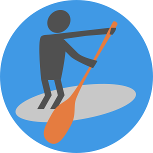

# Paddle - The game engine that makes it easy to create browser games in Rust

*Work in progress, documentation will be added as the project matures...*

## Core ideas
 * For the web only
 * Allow using browser capabilities like HTML + CSS user interfaces, native SVG rendering, and more to come in the future
 * Compatibility with as many browser versions and devices as possible (WebGL 1 only, touch support for various browsers, etc.)
 * Simple interface friendly for people new to Rust, gamedev, or even programming in general
 * Optimized for simple games, mostly 2D

